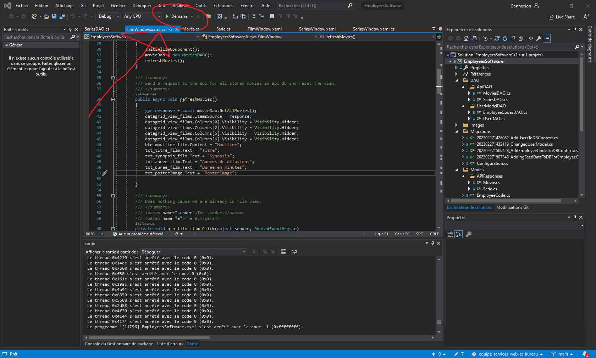
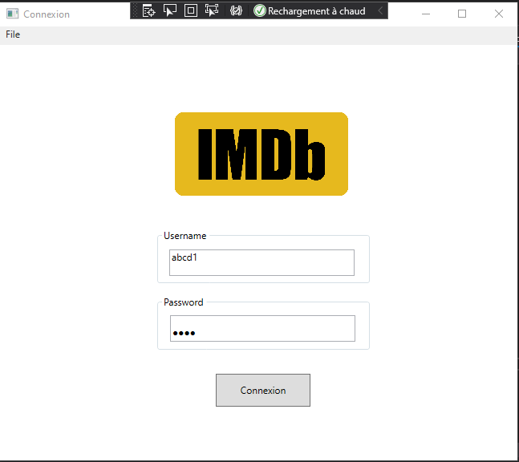
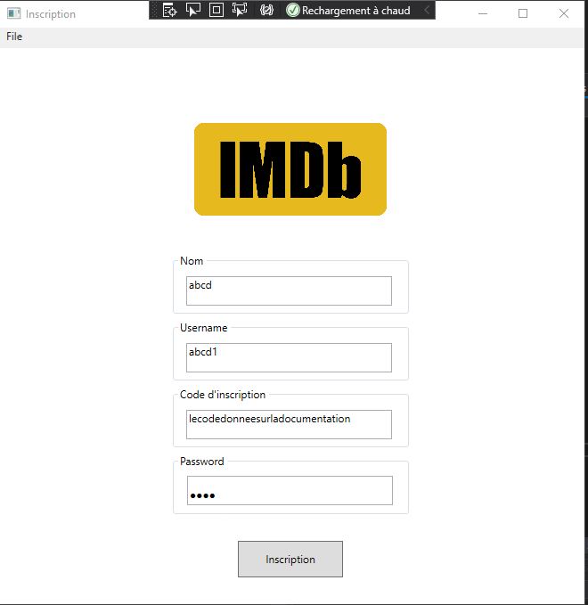
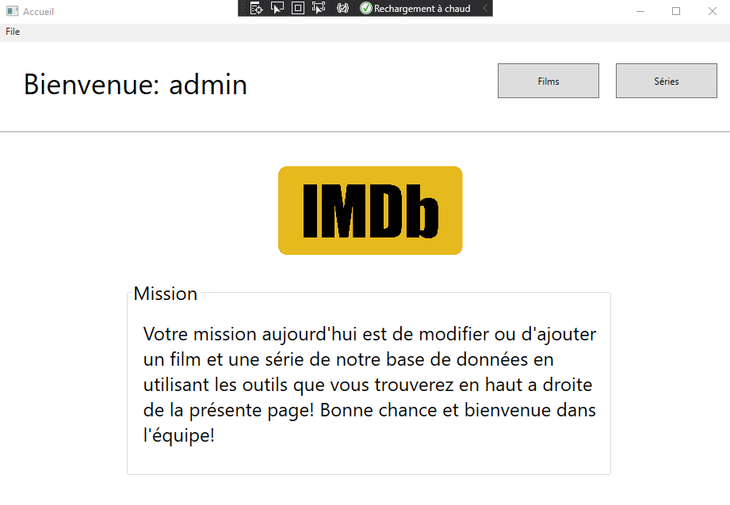
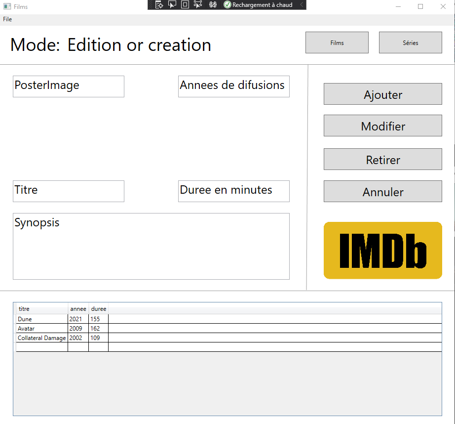
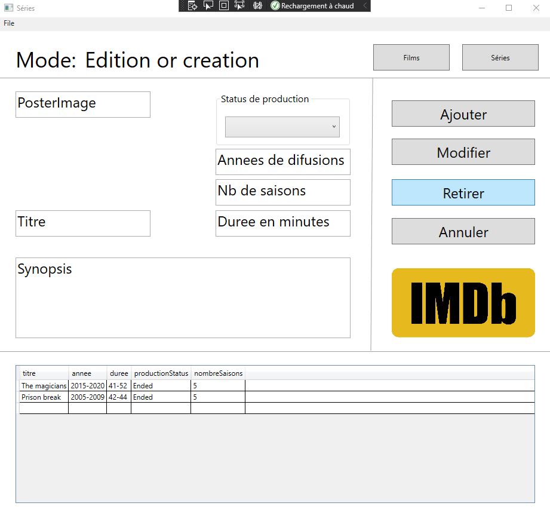

# Desktop client

Nous verrons ici toutes les étapes nécessaires à l'utilisation de ce client desktop pour notre projet final en Développement d'applications de bureau.

- [Desktop client](#desktop-client)
  - [Installation](#installation)
  - [Documentation](#documentation)
  - [Utilisation](#utilisation)
    - [Inscription](#inscription)
    - [Connexion](#connexion)
  - [Gallerie du projet](#gallerie-du-projet)
    - [La page de connexion](#la-page-de-connexion)
    - [La page d'inscription](#la-page-dinscription)
    - [La page d'accueil](#la-page-daccueil)
    - [La page de films](#la-page-de-films)
    - [La page de séries](#la-page-de-séries)
  - [Support](#support)
  - [Auteurs et reconnaissances](#auteurs-et-reconnaissances)
    - [Les membres de l'équipe](#les-membres-de-léquipe)
  - [État du projet](#état-du-projet)

## Installation

Pour utiliser notre client desktop il est essentiel d'avoir préalablement suivit les étapes d'installation de notre API. Voir le README dans le dossier API du présent projet.

Si c'est fait, suivez ces instructions.

1. Télécharger le projet sur votre machine.
2. Ouvrir le fichier EmployeesSoftware.sln dans le dossier EmployeesSoftware.

3. Cliquer sur le bouton démarrer de l'interface vs studio. Voir image référence.

    

## Documentation

Il suffit de lancer le fichier [index.html](./EmployeesSoftware/EmployeesSoftware/html/index.html)

## Utilisation

### Inscription

1. Vous pouvez utiliser le menu pour vous inscrire comme employé.
2. Si vous décidez d'utiliser le menu d'inscription vous aurez besoin d'un code secret. Voici une liste.

    | Inscription Code    |
    | --------------- |
    | opacity-selected-briskly |
    | contempt-chalice-turbofan   |
    | crank-trailside-glaring   |
    | antics-dispersal-undoing   |
    | gills-sister-oversized   |
    | shortcut-idealness-regress  |
    | prelaunch-freewill-drowsily  |
    | dreamboat-crayfish-task  |

3. Si vous utiliser un code, veuillez éditer le markdown pour laisser savoir aux autres combien il en reste. J'implémenterai à l'avenir une méthode pour en rajouter, mais pour l'instant les comptes actifs et leur mots de passe seront simplement mis dans la prochaine section.

### Connexion

1. Vous pouvez utiliser un des comptes suivants pour la connexion
    | Username   | Password   |
    |--------------- | --------------- |
    | admin  | 1234 |
    | prof  | 1234   |

## Gallerie du projet

Vous Aurez des résultats différents selon les films et séries ajoutés dans la base de données ! Vous devriez néanmoins retrouver la même mise en forme!

### La page de connexion

### La page d'inscription

### La page d'accueil

### La page de films

### La page de séries

## Support

Pour toutes questions, vous pouvez contacter un membre de l'équipe de développement aux adresses courriels suivantes ou sur leur github:

1. Charlie Wambo : <https://github.com/charliewambo31>
2. Robert-Sergo Dimanche: robertsergodimanche@gmail.com
3. Christopher Desrosiers Mondor : desrosch@gmail.com

## Auteurs et reconnaissances

### Les membres de l'équipe

1. Charlie Wambo
2. Robert-Sergo Dimanche
3. Christopher Desrosiers Mondor

## État du projet

Le projet est en développement et dans le processus d'être évalué pour le projet final combiné entre Services Web et Développement d'applications de bureau dans le cadre d'un AEC en développement de logiciels.
