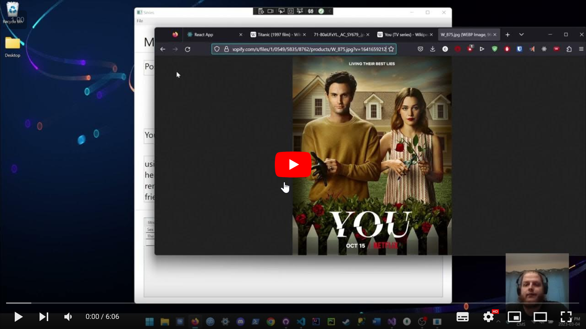
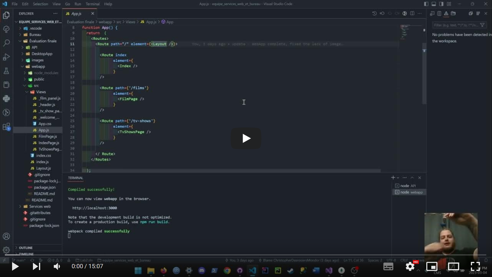

# Bienvenue à mon évaluation finale

Conjointement pour les cours de services web et de développement d'applications de bureau vous retrouverai ici toutes les informations pour le travail final.

## Guide utilisateur

Voici le lien pour le guide utilisateur:

## Guide développeur

Voici le lien pour le guide développeur:

## Liens vers les README de chaque sections

API : [API](https://github.com/ChristopherDesrosiersMondor/MERN-WPF-API-AND-CLIENTS/tree/main/API)

Client web: [Client web](https://github.com/ChristopherDesrosiersMondor/MERN-WPF-API-AND-CLIENTS/tree/main/webapp)

Client bureau: [Client bureau](https://github.com/ChristopherDesrosiersMondor/MERN-WPF-API-AND-CLIENTS/tree/main/DesktopApp)

## Sources et inspiration

Pour l'enregistrement des guides:

<https://www.youtube.com/watch?v=-puA85ciDEM&ab_channel=JustinBrown-PrimalVideo>
