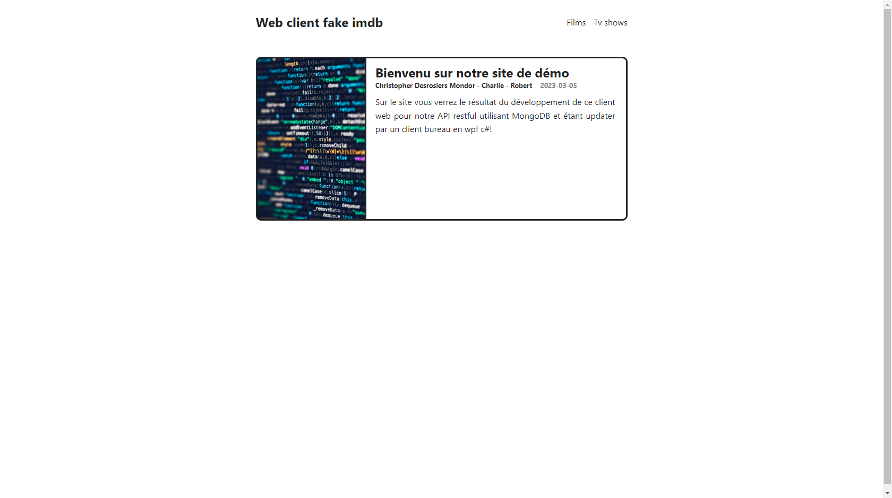
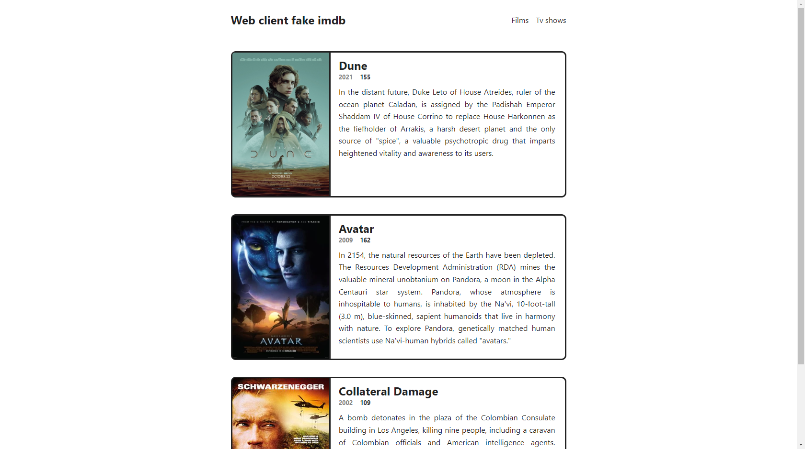
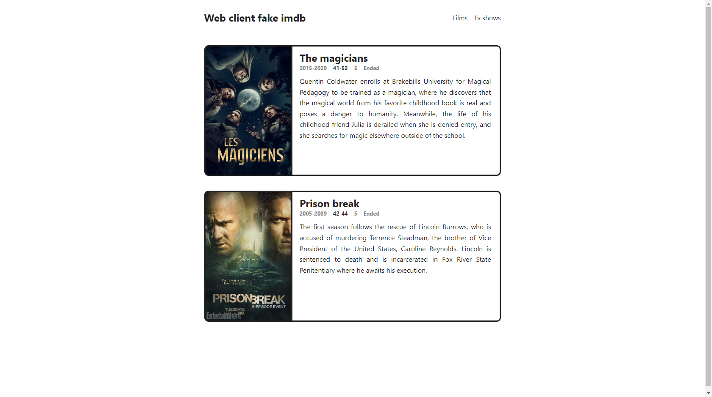

# Web client

Nous verrons ici toutes les étapes nécessaires à l'utilisation de ce client web pour notre projet final en Services Web.

- [Web client](#web-client)
  - [Installation](#installation)
  - [Gallerie du projet](#gallerie-du-projet)
    - [La page d'accueil](#la-page-daccueil)
    - [La page de films](#la-page-de-films)
    - [La page de séries](#la-page-de-séries)
  - [Les sources d'inspirations et d'apprentissage](#les-sources-dinspirations-et-dapprentissage)
  - [Support](#support)
  - [Auteurs et reconnaissances](#auteurs-et-reconnaissances)
    - [Les membres de l'équipe](#les-membres-de-léquipe)
  - [État du projet](#état-du-projet)

## Installation

Le déploiement est encore au niveau du développement donc plusieurs étapes sont nécessaires pour utiliser notre client web. Assurez-vous d'avoir suivi les étapes d'installation de l'API avant de continuer ici.

1. Télécharger le projet sur votre machine.
2. Installer mangodb community server - Pendant l'installation conservez les configurations par default.
<https://www.mongodb.com/try/download/community>

3. Ouvrir MongoDBCompass et vous connecter à l'adresse de la base de donnée proposée (ce devrait être : mongodb://localhost:27017).

4. Positionnez vous dans le dossier webapp à l'aide de la commande suivante

    ```shell
    cd '.\Évaluation finale\webapp\'
    ```

5. Lancer la commande suivante pour installer les dépendances du projet

    ```shell
    npm install
    ```

6. Lancer l'api avec la commande suivante

    ```shell
    npm start
    ```

## Gallerie du projet

Vous Aurez des résultats différents selon les films et séries ajoutés dans la base de données à l'aide de l'outil bureau! Vous devriez néanmoins retrouver la même mise en forme et page d'accueil!

### La page d'accueil



### La page de films



### La page de séries



## Les sources d'inspirations et d'apprentissage

1. Pour le look and feel et la séparation du code en suivant un bon modèle. Pour le layout et la séparation des views.
   - Source: <https://www.youtube.com/watch?v=xKs2IZZya7c>

## Support

Pour toutes questions, vous pouvez contacter un membre de l'équipe de développement aux adresses courriels suivantes ou sur leur github:

1. Charlie Wambo : <https://github.com/charliewambo31>
2. Robert-Sergo Dimanche: robertsergodimanche@gmail.com
3. Christopher Desrosiers Mondor : desrosch@gmail.com

## Auteurs et reconnaissances

### Les membres de l'équipe

1. Charlie Wambo
2. Robert-Sergo Dimanche
3. Christopher Desrosiers Mondor

## État du projet

Le projet est en développement et dans le processus d'être évalué pour le projet final combiné entre Services Web et Développement d'applications de bureau dans le cadre d'un AEC en développement de logiciels.
